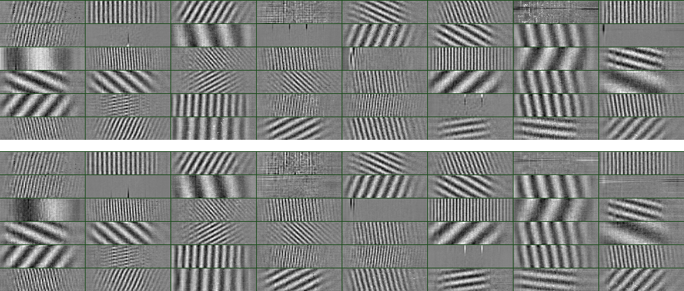
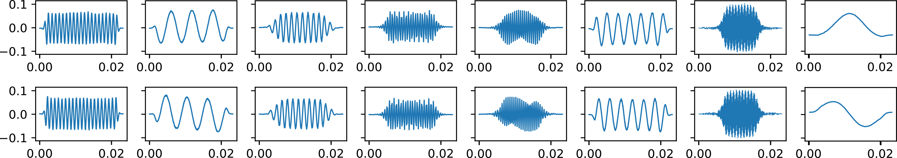
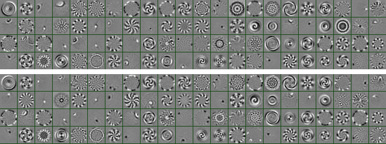

## Complex Autoencoder for Learning Invariant Signal Representations

PyTorch implementation of the Complex Autoencoder proposed in 

*Learning Complex Basis Functions for Invariant Representations of Audio* [[pdf]](http://www.stefanlattner.at/data/paper_complex_auto_arxiv.pdf)<br/>
Stefan Lattner¹, Andreas Arzt², Monika Dörfler³, 2019<br/>

*¹Sony CSL Paris*<br/>
*²Institute of Computational Perception, JKU Linz*<br/>
*³Faculty of Mathematics, University of Vienna*<br/>

### Outline ###

* Prerequisites
* [Quick Start](#quick-start)
* Training for Audio (CQT Representation)
* Convert Audio Files to Invariant Features
* Extract Repeated Themes and Sections
* 1D Signal Experiment
* Rotated MNIST Experiment

### Prerequisites ###

* [PyTorch](http://www.pytorch.org)
* Librosa
* ConfigObj
* Pillow
* Numpy
* Scipy
* Matplotlib
* Scikit-Learn
* Torchvision
* Tqdm


To install (update) the requirements using **pip**, run:
```
  pip install -r requirements.txt
```

## Audio Experiments (CQT)
### Quick Start ###

1. **Edit the text file** with name *filelist_audio.txt*, or keep the default entries. The file should be in the form

*filelist_audio.txt:*
```
data/audio1.wav
data/audio2.wav
data/audio3.wav
```
Save the file in the root folder of the project. We recommend ~1 hour of music 
for training with the default parameters.

2. **Run all steps for repeated section discovery** (training, conversion, 
motive extraction, evaluation) using the following command (choose a 
*run_keyword*):

```
  ./run_batch_audio.sh run_keyword
```
Note that the files in filelist_audio.txt are only used for training, while 
motive extraction and evaluation is performed on the JKU dataset.

### Training for Audio (CQT Representation) ###



This experiment yields *2D Complex Basis Functions* which resemble 2D 
Fourier components.

1. **Create a text file** (or use existing *filelist_audio.txt*), which lists
 audio files to use for training, as shown in the section above.

2. **Start training** using the following command
(choose a *run_keyword*, add `--help` to list all parameters):
```
  python train.py run_keyword filelist_audio.txt config_cqt.ini
```
Note that file preprocessing will be cached. Thus, when changing 
data-related *parameters* or when modifying the content of *filelist_audio.txt*, 
use the flag `--refresh-cache`.
An experiment folder `output/run_keyword` will be created, where all files regarding the experiment (including plots and parameters of the trained network) will be placed.

### Convert Audio Files to Invariant Features

1. **Create a text file** (or use existing *filelist_audio.txt*) which lists
 the audio files to convert (see Section [Quick Start](#quick-start)).

2a. **Convert files**, run (using the same *run_keyword* as in the 
training):
```
  python convert.py run_keyword filelist_audio.txt config_cqt.ini
```
The converted files will be saved (bz2 compressed pickle) in the experiment folder `output/run_keyword`.
A method to load the compressed files as numpy arrays can be found in `complex_auto/utils.py
 -> load_pyc_bz(filename)`.

2b. In order to **create a self-similarity matrix** for each audio file, run
```
  python convert.py run_keyword filelist_audio.txt config_cqt.ini --self-sim-matrix
```
The self-similarity matrices are saved in the `output/run_keyword` folder 
together with a file `ss_matrices_filelist.txt`, which lists the paths to 
the stored matrices (used by the motive extractor in the next step).

### Extract Repeated Themes and Sections

The motive extractor reads the file `ss_matrices_filelist.txt` as generated 
in the *step 2b* above. Ensure that you performed that step and also to use 
the same *run_keyword* for all steps.
 
**Run the motive extractor** using
```
python extract_motives.py run_keyword -r 2 -th 0.01
```
where depending on the CAE training and the dataset used, different `-r` and 
`-th` values may lead to better results. The found patterns are then 
written to `.segraw` files into the folder
`output/run_keyword`. The evaluation using `extract_motives_eval.py` 
together with `extract_motives.py` is currently only implemented for the 
*JKU Dataset*, as *groundtruth annotations* and *bpm information* has to be 
available. In order to test the full pipeline, see Section
[Quick Start](#quick-start).

## 1D Signal Experiment

### Training for Audio (Time Domain)



This experiment yields *1D Complex Basis Functions* which resemble 
complex Gabor-like filters.

1. **Create a text file** (or use existing *filelist_signal.txt*) which lists 
audio files to convert (see Section [Quick Start](#quick-start)).
Here, **only one audio** file is sufficient (when all frequencies are present).

2. **Start training** using the following command
(choose a *run_keyword*, add `--help` to list all parameters):

```
python train.py run_keyword filelist_signal.txt config_signal1D.ini
```

All results can be found in `output/run_keyword`.


## Rotated MNIST Experiment

### Training for Rotated MNIST



This experiment yields basis functions representing the complex Eigenvectors 
of *rotation*.

1. **Download the rotated MNIST dataset** using [this link](http://www.stefanlattner.at/data/mnist_rot.pyc.bz) and place it in the data folder: `./data/mnist_rot.pyc.bz`.

2. **Start training** using the following command (choose a *run_keyword*, add `--help` to list all parameters):

```
python train.py run_keyword no_filelist config_mnist.ini
```

All results can be found in `output/run_keyword`.
